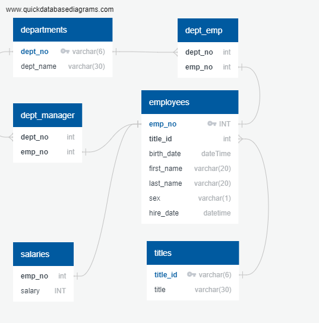

# sql-challenge
These are the project files for the sql-challenge.

The data for the sql file is found in the data folder.

To get a basic idea of what the database's structure is, look at 

In order to initialize the sql-database, run the schema found in employee_db_schema.sql. Populate each table with the corresponding excel notebook from the data folder.

queries.sql contains a number of relevant queries to the database.

Finally, the sql_bonus file contains a jupyter notebook where I imported relevant portions of the database into python, queried it, and demonstrated that the salary was randomly distributed between the different titles in the database.
